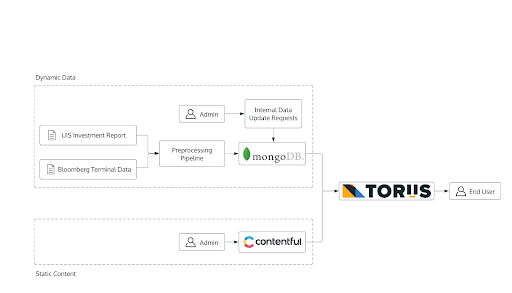
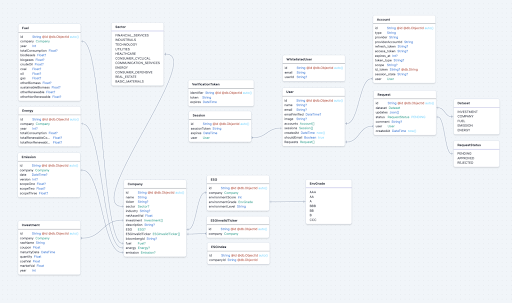

# Welcome to the TORIIS.earth Documentation!
This repository contains all the documentation for the TORIIS project. 

## Getting Started
* [Web site](https://www.toriis.earth/) 
* [Code base on github](https://github.com/toriis-portal/toriis)
* [Style guide](https://www.figma.com/design/PFCGAeZzwLEyzNaovh6Zfq/Toriis?node-id=2653-2709&p=f)
* [License](LICENSE.md)

## What is TORIIS.earth?
[TORIIS.earth](https://www.toriis.earth/) (Transparent and Open Resource for Institutional Investments) is an interactive and dynamic web interface to visualize the University of Illinois Systems’ investment portfolio, focusing on assets invested in corporations that profit from the extraction, transportation, or combustion of coal, petroleum, or natural gas.

It allows users to search, sort, visualize, and analyze the University of Illinois System’s investments. It enables administrators to update databases, manage administrative access, and systematically maintain the website.

## Tech Stack
TORIIS.earth uses the full [T3 Stack](https://create.t3.gg/), which includes NextJs, TypeScript, tRPC, Prisma, Tailwind CSS, and NextAuth. Why? 
* Allows bundling the front and backend together as a mono-repo
* End-to-end type safety 
* This project doesn't require serving external APIs
* Highly-customized frontend components  

We use [MongoDB Atlas](https://account.mongodb.com/) as our NoSQL cloud database. Why? 
* No strong relationship between data schemas 
* Ease of schema modification, which allows for continuous exploration and addition of new data attributes
* A large portion of the data contains empty values, NoSQL offers better handling of unstructured data 

In addition, (Contentful)[https://be.contentful.com] is used for managing text information, offering a streamlined content management system that allows for easy updates and modifications.

## Database
We can divide the Database Schema into three major parts 
* Core Company Data (obtained from UIS investment report) 
    * Company
    * Investment (one-to-many w/ Company) 
* Environmental Data (one-to-one w/ Company)  (received from Bloomberg terminal)   
    * Fuel
    * Energy
    * Emission 
    * ESG (Invalid ESG, and ESG Index) 
* User and Administrator
    * User (Whitelist User, Account, Session) 
    * Request 

Following the following schema when parsing new data into the database is essential.  

## External APIs
In addition to the data we have from the university and Bloomberg terminal, we are using the following external API in the project 
* [ESG as a Service](https://www.esgenterprise.com/esg-analytics/esg-as-a-service/)
    * [Their only Documentation](https://www.esgenterprise.com/esg-enterprise-data-api-services/)
    * As far as we can tell, this API is not super stable + it has a limit of 50 daily calls, should definitely look into alternatives 
    * New discovery - it seems that they are blocking some of our calls now (access keys become unauthorized), so we should 100% shift to some other methods for retrieving ESG data  
* [Node Yahoo Finance 2](https://github.com/gadicc/node-yahoo-finance2/blob/devel/docs/modules/historical.md)
    * Used primarily for retrieving closing share prices for companies  
* [yfinance](https://github.com/ranaroussi/yfinance)
    * Used in Python Notebooks to retrieve description, sector, and industry information for companies 

## Design
The entire website is based on the design from the [Figma ‘Complete’ Section](https://www.figma.com/file/PFCGAeZzwLEyzNaovh6Zfq/Toriis?type=design&node-id=2653%3A2709&t=PgZArzDx2xoiQawZ-1). [HeroIcon](https://heroicons.com/) is used for all icons and [ApexChart](https://apexcharts.com/) for all dynamic and interactive graphs. Detailed information about the design system is available in the Figma file.